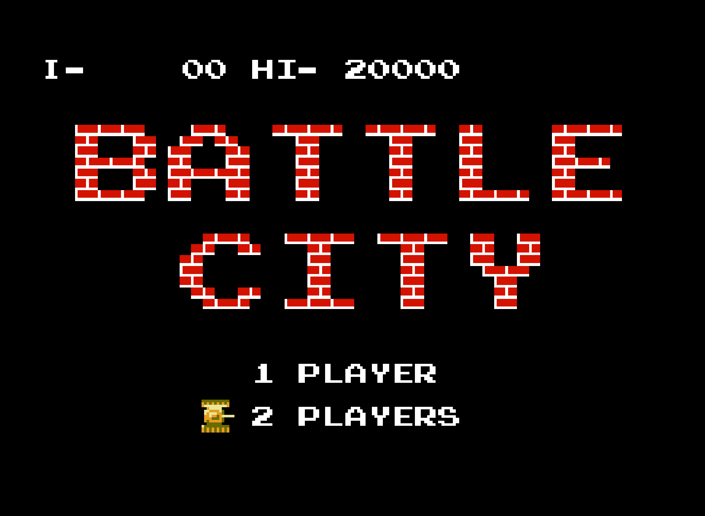
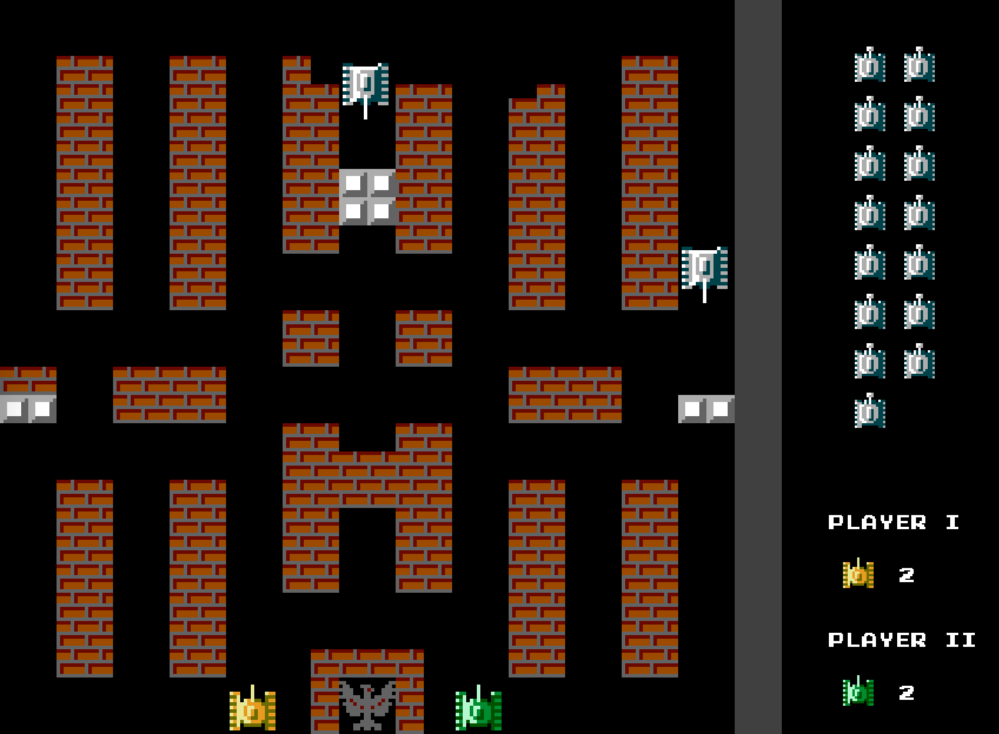
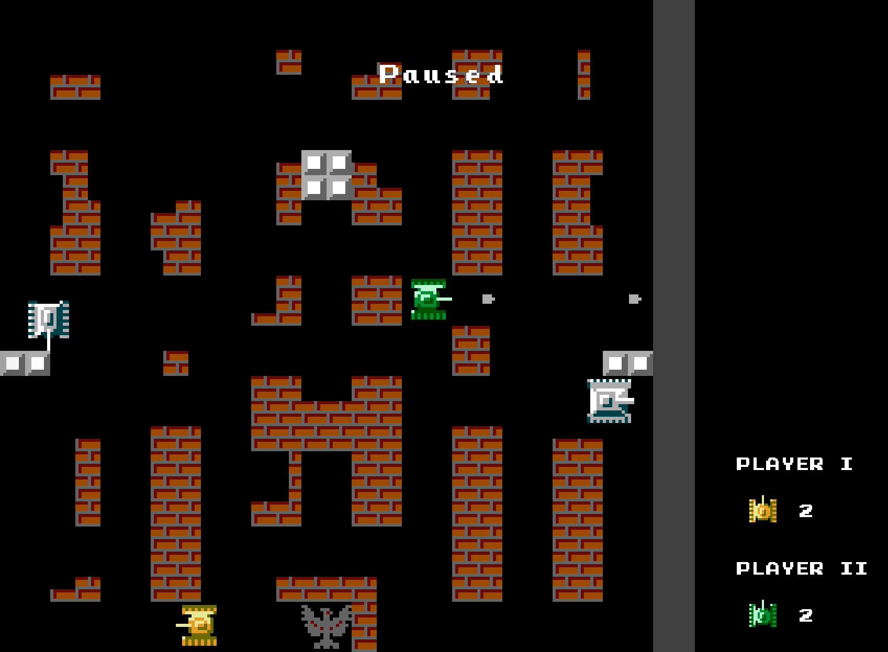
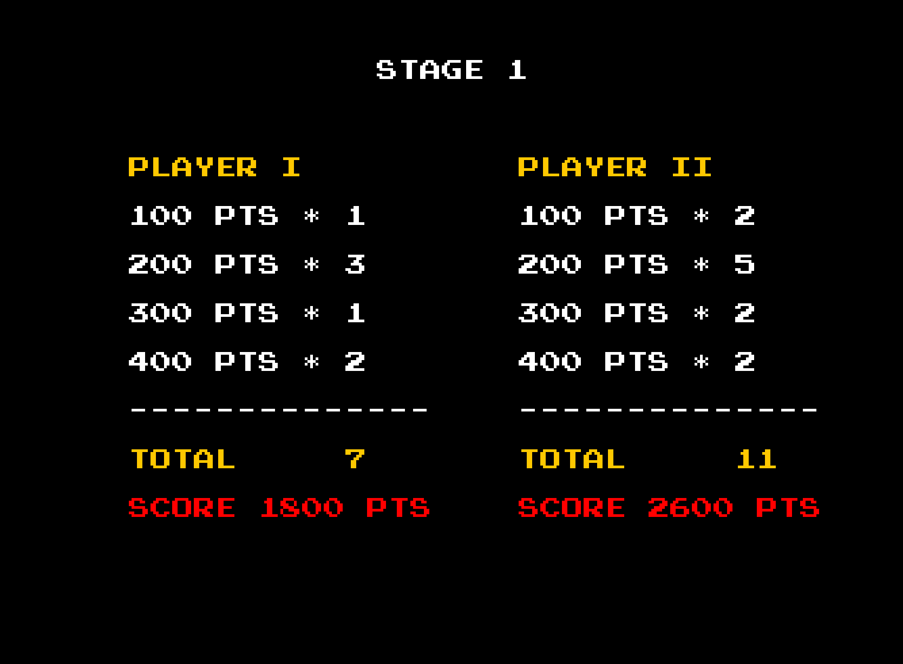

# Battle City

## How to play

### Single player v.s. two players

| Key | Function |
| --- | --- |
| Up arrow | Single player |
| Down arrow | Two players |
| Enter | Select and enter game |

### Play in the game

Player I

| Key | Function |
| --- | --- |
| W | Go up |
| S | Go down |
| A | Go left |
| D | Go right |
| Space | Fire bullet |

Player II

| Key | Function |
| --- | --- |
| Up arrow | Go up |
| Down arrow | Go down |
| Left arrow | Go left |
| Right arrow | Go right |
| Enter | Fire bullet |

Any player

| Key | Function |
| --- | --- |
| P | Pause game |
| Q | Quit game |

### Note

Please note that, if you are using MacOS, you may need to disable the key press and hold feature, in order to play smoothly. Please run the following command in terminal, and log in your account again to make it effective.

```
defaults write -g ApplePressAndHoldEnabled -bool false
```

## Screenshots










